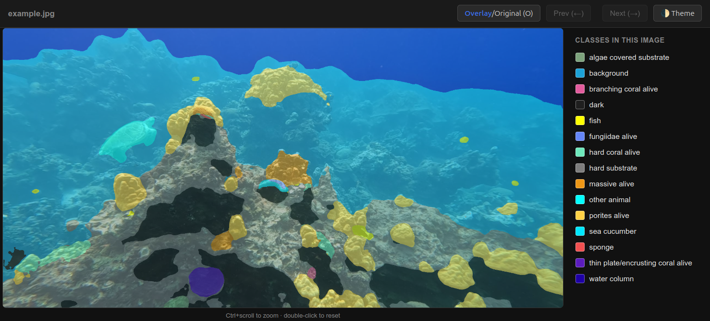

# Coralscapes Image Viewer

Run [Coralscapes](https://josauder.github.io/coralscapes/) / [CoralscapesV2](https://josauder.github.io/coralscapesv2/) semantic segmentation models and generate **an interactive HTML viewer** that makes interpreting outputs much easier or, if you prefer, typical static png/jpg outputs.

- Project page: https://josauder.github.io/coralscapesv2/
- Paper: https://arxiv.org/pdf/2609.12826
- Models: https://huggingface.co/EPFL-ECEO

This script is adapted from the video inference example code provided by the Coralscapes authors. I created it because it can be challenging to interpret Coralscapes outputs on your own data with 39 or 95 classes, and because [the official repo](https://github.com/josauder/dinov3_lora_dpt_coralscapes) has not yet been updated to run the new 95-class CoralscapesV2 models.


[Download this example](example/example_segmented.html) and open it in your browser to try the interactive viewer.

## Setup

Install [Pixi](https://pixi.sh) if you do not have it
```bash
curl -fsSL https://pixi.sh/install.sh | sh
```

Clone this repository
```bash
git clone https://github.com/Matt-Tav/coralscapes_image_view.git
cd coralscapes_image_view
```
 
Install dependencies - pick **one**:
```bash
pixi install          # NVIDIA GPU (CUDA)
pixi install -e cpu   # CPU only, skips CUDA packages
```
 
If you installed `-e cpu`, add `-e cpu` when running e.g `pixi run -e cpu python predict_image.py ...`


## Example

**CoralscapesV2 39-class vit-b model** (default):

```bash
pixi run python predict_image.py --input path/to/my_image_or_folder
```

**CoralscapesV2 95-class vit-l model** (specify config for alternative models):

```bash
pixi run python predict_image.py \
  --input path/to/my_image_or_folder \
  --repo-id EPFL-ECEO/coralscapesv2-dinov3-vitl-lora-dpt-95_class \
  --config configs/vit_l.yaml \
  --classes dataset_metadata/classes_95.json \
  --colours dataset_metadata/colours_95.json
```

A single image will generate `my_image_segmented.html`.

A folder will generate `my_image_folder_segmented`, containing the per image outputs.

## Flags

| Flag | Description |
|---|---|
| `--repo-id` | Hugging Face model repo to download and run, e.g. `EPFL-ECEO/coralscapesv2-dinov3-vitb-lora-dpt`. |
| `--input` | Image file or folder to process. |
| `--output` | Output name (single input) or output folder name (folder input). Defaults to `<input>_segmented`. |
| `--output-ext` | Output type: `.html` (interactive viewer, default), `.jpg`, or `.png` (static image). |
| `--config` | Model config YAML, matched to the backbone size (`vit_s.yaml` / `vit_b.yaml` / `vit_l.yaml`). |
| `--classes` | Class-name JSON, matched to the model's class count (default `classes_39.json`). |
| `--colours` | Class-colour JSON, matched to the model's class count (default `colours_39.json`). |
| `--device` | Inference device: `cuda`, `cuda:0`, `cpu`, etc. Auto-detected if omitted. |
| `--mask-only` | Only output the colourised prediction, without the original/overlay toggle. |
| `--no-legend` | No colour-key legend (`.jpg`/`.png` outputs only) |
| `--legend-all-classes` | List every known class in the legend, not just classes present in the image (`.jpg`/`.png` outputs only). |
| `--recursive` | When `--input` is a folder, search it recursively for images. |

## Repo layout

```
.
├── configs/              # model configs for each backbone
│   ├── vit_s.yaml
│   ├── vit_b.yaml
│   └── vit_l.yaml
├── dataset_metadata/     # class names + colours
│   ├── classes_39.json
│   ├── colours_39.json
│   ├── classes_95.json
│   └── colours_95.json
├── example/              # sample output
│   ├── example_screenshot.png
│   └── example_segmented.html
├── predict_image.py      # the script
├── pixi.toml
├── pixi.lock
└── README.md
```

## Citation

If you use Coralscapes or CoralscapesV2 please cite the authors:

```bibtex
@inproceedings{sauder2025coralscapesdatasetsemanticscene,
  title={The Coralscapes Dataset: Semantic Scene Understanding in Coral Reefs},
  author={Jonathan Sauder and Viktor Domazetoski and Guilhem Banc-Prandi and Gabriela Perna and Anders Meibom and Devis Tuia},
  booktitle={Proceedings of the International Conference on Computer Vision Joint Workshop on Marine Vision},
  year={2025}
}

@inproceedings{sauder2026coralscapesv2,
  title={CoralscapesV2: Panoptic and Fine-Grained Visual Scene Understanding in Coral Reefs},
  author={Sauder, Jonathan and Ruckli, Thomas and Strodomskyt{\.e}, Gabriel{\.e} and Abdallah, Ibrahim Souleiman and Abdi, Rahma Hassan and Awaleh, Djama Goumaneh and Farah, Mohamed Houssein and Nour, Moustapha and Saad, Osama Sharhubil and Altaib, Mustafa Mohammed Khalafallah and Kteifan, Maysoon and Alsoqi, Farah and Zgool, Eyad and Al-Omari, Jafar and Gebreluel, Temesgen Gebremeskel and Abdulkerim, Zekaria Zekeria and Ghirmay, Meron and Beraki, Teklehaimanot and Tuia, Devis and Banc-Prandi, Guilhem},
  booktitle={Proceedings of the European Conference on Computer Vision (ECCV) Workshop on Marine Vision},
  year={2026}
}
```
